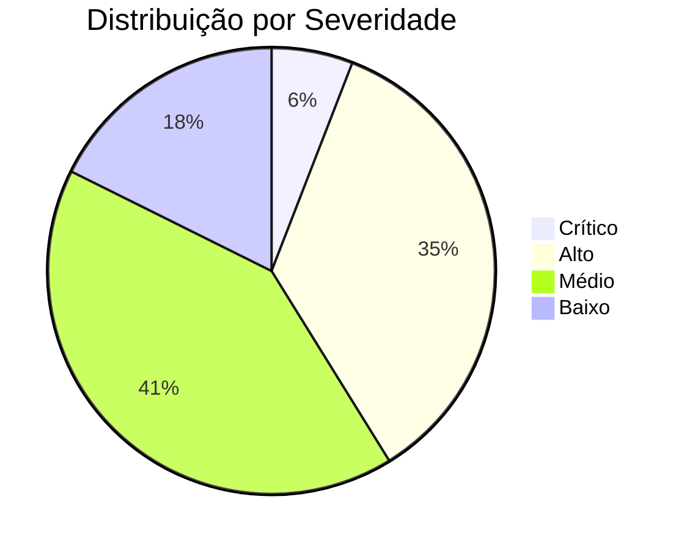

# 🔬 Relatório de Auditoria — Nexus Engine

> **Escopo:** 18 arquivos do pacote `internal/services/nexus/`
> **Data:** 2026-05-10
> **Foco:** Performance, Segurança e Arquitetura Enterprise

---

## Índice de Severidade

| Nível | Significado |
|-------|-------------|
| 🔴 **CRÍTICO** | Impacto direto em segurança ou estabilidade em produção |
| 🟠 **ALTO** | Gargalo significativo ou risco que escala com carga |
| 🟡 **MÉDIO** | Melhoria importante para enterprise-grade |
| 🟢 **BAIXO** | Otimização de polish e refinamento |

---

## 1. GARGALOS DE PERFORMANCE

### 🟠 1.1 — Clone de Pacotes via JSON Roundtrip

**Arquivo:** [packet.go](file:///home/cocorico/Documentos/proejetos/cascata%20go/backend/internal/services/nexus/packet.go#L90-L95)

```go
// Deep clone Data via JSON roundtrip
if ip.Data != nil {
    rawData, _ := json.Marshal(ip.Data)
    clone.Data = make(map[string]interface{})
    json.Unmarshal(rawData, &clone.Data)
}
```

**Problema:** Cada `Clone()` faz `Marshal + Unmarshal` — é a operação mais cara do Go para dados genéricos. Em um grafo com 10 nós e branching, isso pode gerar **20-30 clones por execução**. Com payloads de 100KB, são ~6MB de serialização por request.

**Impacto:** Em fluxos Fast Lane (PRE_PERSIST) com payloads grandes, a latência pode ir de ~2ms para ~15-20ms só por causa de clones.

**Solução:**
- Implementar copy-on-write (COW) para `map[string]interface{}`
- Ou usar uma função de deep copy manual recursiva (3-5x mais rápida que JSON roundtrip)
- Para dados imutáveis entre nós (maioria dos casos), compartilhar referência com flag de somente leitura

---

### 🟠 1.2 — HTTP Client Não Compartilhado

**Arquivo:** [node_http.go](file:///home/cocorico/Documentos/proejetos/cascata%20go/backend/internal/services/nexus/node_http.go#L24-L37)

```go
func NewHTTPComponent(id string, allowlist []string) *HTTPComponent {
    return &HTTPComponent{
        // ...
        client: &http.Client{
            Timeout: 15 * time.Second,
        },
    }
}
```

**Problema:** Cada instância de `HTTPComponent` cria seu próprio `http.Client`. O Go reutiliza connections via `Transport.IdleConnPool`, mas **apenas dentro do mesmo `http.Client`**. Se você tem 5 nós HTTP em um grafo, cada um cria seu pool de connections separado.

**Impacto:** Conexões TCP não são reutilizadas entre nós HTTP. Cada nó paga o custo de TCP handshake + TLS handshake (~100-300ms para HTTPS externo).

**Solução:**
- Criar um `http.Client` global (ou por-engine) com `Transport` configurado
- Pool de conexões compartilhado com `MaxIdleConnsPerHost: 100`
- `Transport.IdleConnTimeout: 90s` para manter conexões vivas entre execuções

---

### 🟠 1.3 — Audit Log Síncrono e Bloqueante

**Arquivo:** [nexus_audit.go](file:///home/cocorico/Documentos/proejetos/cascata%20go/backend/internal/services/nexus/nexus_audit.go#L13-L97)

```go
func RecordExecution(...) {
    _, err := systemPool.Exec(ctx, `INSERT INTO system.nexus_execution_log ...`)
    // ... loop por cada nó ...
    for nodeID, nodeResult := range result.NodeResults {
        _, stepErr := systemPool.Exec(ctx, `INSERT INTO system.automation_step_logs ...`)
    }
}
```

**Problema:** O `RecordExecution` é chamado no caminho síncrono do `ResolvePrePersist` e `ResolvePostPersistSync`. Se o grafo tem 10 nós, são **11 INSERTs sequenciais** no PostgreSQL antes de retornar a resposta ao cliente.

**Impacto:** Em PRE_PERSIST, cada INSERT no PostgreSQL custa ~1-3ms. Com 10 nós = 11-33ms adicionais na latência. Isso é **inaceitável** para um motor que tem Dragonfly e Go como stack de velocidade.

**Solução:**
- **Batch INSERT** — usar `COPY` ou multi-row INSERT em vez de N inserts separados
- **Fire-and-forget com Dragonfly** — gravar audit logs primeiro no Dragonfly (LPUSH) e consumir via goroutine dedicada para o PostgreSQL
- Separar o `RecordExecution` do caminho crítico com `go RecordExecution(...)` (já existe em `NexusService.LogExecution` mas NÃO é usado no HookResolver)

---

### 🟡 1.4 — findCompiledNode é O(n) Linear

**Arquivo:** [nexus_engine.go](file:///home/cocorico/Documentos/proejetos/cascata%20go/backend/internal/services/nexus/nexus_engine.go) — `findCompiledNode`

```go
func findCompiledNode(plan *ExecutionPlan, nodeID string) *CompiledNode {
    for i := range plan.Nodes {
        if plan.Nodes[i].ID == nodeID {
            return &plan.Nodes[i]
        }
    }
    return nil
}
```

**Problema:** Chamado **para cada nó** durante a execução. Se o grafo tem N nós, a busca total é O(N²). Com 50+ nós, isso é mensurável.

**Solução:** Pré-computar `map[string]*CompiledNode` no `buildPlan()` e armazená-lo no `ExecutionPlan`.

---

### 🟡 1.5 — UUID Gerado por Clone Sem Necessidade

**Arquivo:** [packet.go](file:///home/cocorico/Documentos/proejetos/cascata%20go/backend/internal/services/nexus/packet.go#L76)

```go
func (ip *InformationPacket) Clone() *InformationPacket {
    clone := &InformationPacket{
        ID: uuid.New().String(),  // ← gera UUID v4 a cada clone
```

**Problema:** `uuid.New()` usa `/dev/urandom` ou similar, que é uma syscall. Em fluxos com muito branching, dezenas de UUIDs são gerados sem necessidade real de criptografia.

**Solução:** Usar `uuid.New()` apenas onde o ID precisa ser globalmente único (logs, auditoria). Para IDs internos de pacotes durante execução, usar um contador atômico composto (`traceID-seq`) que é ~100x mais rápido.

---

### 🟡 1.6 — Dragonfly Subutilizado no Cache de Planos Compilados

**Arquivo:** [nexus_hook_resolver.go](file:///home/cocorico/Documentos/proejetos/cascata%20go/backend/internal/services/nexus/nexus_hook_resolver.go#L532-L565)

**Problema:** O plano compilado é cacheado no Dragonfly com TTL de 24h, mas o `getOrCompilePlan` faz:
1. GET do Dragonfly → Unmarshal JSON
2. Se miss → Compile + Marshal + SET

O Unmarshal do plano completo a cada hit pode custar 1-5ms dependendo do tamanho do grafo.

**Solução:**
- Cache **em memória** (in-process) com `sync.Map` ou LRU para planos hot (TTL 5min)
- O Dragonfly serve como L2 cache (TTL 24h)
- Invalidação via pub/sub do Dragonfly quando automação é atualizada

---

### 🟡 1.7 — Interpolação Regex Compilada Mas Re-executada

**Arquivo:** [nexus_state.go](file:///home/cocorico/Documentos/proejetos/cascata%20go/backend/internal/services/nexus/nexus_state.go#L215-L247)

```go
var interpolationRegex = regexp.MustCompile(`\{\{([^}]+)\}\}`)
```

**Problema:** O regex é compilado uma vez (bom), mas o `ReplaceAllStringFunc` com closure faz alocações a cada chamada. Em fluxos com muitas variáveis (response mapping, headers, body templates), isso gera pressão no GC.

**Solução:** Para strings sem `{{`, fazer short-circuit antes de chamar o regex. Adicionar check rápido:
```go
if !strings.Contains(template, "{{") {
    return template
}
```

---

### 🟢 1.8 — NexusState Mutex Contention em Modo Paralelo

**Arquivo:** [nexus_state.go](file:///home/cocorico/Documentos/proejetos/cascata%20go/backend/internal/services/nexus/nexus_state.go#L44)

**Problema:** O `NexusState` usa um único `sync.RWMutex` para todos os acessos. Em modo `atomic_parallel`, múltiplas goroutines competem por esse lock para:
- `SetNodeOutput` (write)
- `GetVar`/`SetVar` (read/write)
- `Interpolate` → `resolveExpression` (read)

**Solução:** Particionar o state em múltiplos locks:
- `nodesMu` para nodes map
- `varsMu` para vars map
- Contextos imutáveis (trigger, security, system) não precisam de lock

---

## 2. VULNERABILIDADES DE SEGURANÇA

### 🔴 2.1 — Raw SQL Mode Permite Injection via Interpolação

**Arquivo:** [node_data.go](file:///home/cocorico/Documentos/proejetos/cascata%20go/backend/internal/services/nexus/node_data.go#L367-L401)

```go
func (c *DataComponent) processRawSQL(...) {
    query, err := state.InterpolateString(queryTpl, ip.Data)
    // ...
    results, err := rlsBridge.ExecRLS(ctx, secCtx, query, args...)
}
```

**Problema:** A interpolação de `{{$trigger.campo}}` é feita **diretamente na string SQL** antes de passar para o `ExecRLS`. Se o payload do trigger contiver `'; DROP TABLE users; --`, o valor é interpolado na query.

O No-Code mode usa queries parametrizadas (`$1, $2`) corretamente. Mas o Raw SQL mode interpola valores **na string da query**, não nos args.

**Impacto:** Um atacante que controla o payload de trigger pode executar SQL arbitrário sob o contexto RLS do usuário.

**Solução:**
- Implementar um parser que detecte expressões `{{...}}` no SQL e as substitua por `$N` placeholders, adicionando os valores resolvidos ao array de `args`
- Ou bloquear interpolação dentro de Raw SQL e exigir que o owner use exclusivamente `$1, $2, ...` com args explícitos
- Alternativamente, limitar Raw SQL a roles `admin` ou `service` (L3)

---

### 🟠 2.2 — SSRF Bypass via IPv6 e DNS Rebinding

**Arquivo:** [node_http.go](file:///home/cocorico/Documentos/proejetos/cascata%20go/backend/internal/services/nexus/node_http.go#L127-L155)

```go
if hostname == "localhost" || hostname == "127.0.0.1" ||
    strings.HasPrefix(hostname, "10.") ||
    strings.HasPrefix(hostname, "192.168.") ||
    strings.HasPrefix(hostname, "172.") {
    return fmt.Errorf("security violation: internal networks not allowed")
}
```

**Problema:**
1. **IPv6 bypass:** `[::1]`, `[0:0:0:0:0:0:0:1]`, `[::ffff:127.0.0.1]` não são bloqueados
2. **Decimal IP:** `2130706433` (=127.0.0.1 em decimal) não é bloqueado
3. **DNS Rebinding:** Domínio `evil.com` resolve para `127.0.0.1` no momento do check e para o IP real no momento da conexão
4. **`172.` prefix catch-all:** Bloqueia `172.217.x.x` (Google) indevidamente — deveria ser `172.16.` a `172.31.`
5. **Metadata endpoints:** `169.254.169.254` (AWS/GCP metadata) não é bloqueado

**Solução:**
- Usar `net.ParseIP()` + verificar ranges via `net.IP.IsLoopback()`, `net.IP.IsPrivate()`, `net.IP.IsLinkLocalUnicast()`
- Resolver DNS antes da validação com `net.LookupIP()` e validar o IP resolvido
- Bloquear explicitamente `169.254.0.0/16` (metadata services)

---

### 🟠 2.3 — Response Body Sem Limite de Leitura

**Arquivo:** [node_http.go](file:///home/cocorico/Documentos/proejetos/cascata%20go/backend/internal/services/nexus/node_http.go#L106)

```go
respBody, _ := io.ReadAll(resp.Body)
```

**Problema:** `io.ReadAll` lê toda a resposta em memória sem limite. Um servidor externo malicioso pode enviar 1GB de dados e causar OOM no container.

**Solução:**
```go
respBody, _ := io.ReadAll(io.LimitReader(resp.Body, 10*1024*1024)) // 10MB max
```

---

### 🟠 2.4 — RLS Bridge Aceita `service_role` Sem Validação de Origem

**Arquivo:** [rls_bridge.go](file:///home/cocorico/Documentos/proejetos/cascata%20go/backend/internal/services/nexus/rls_bridge.go#L46-L56)

```go
role := secCtx.AuthSource
if role == "" || role == "anon" || role == "webhook" {
    role = "anon"
} else if role == "service_role" || role == "management" {
    role = "service_role"  // bypassrls
}
```

**Problema:** Se alguém conseguir injetar `AuthSource: "service_role"` no SecurityContext (ex: via manipulação de header ou webhook payload), o RLS é completamente bypass.

**Solução:**
- O `AuthSource` deve vir exclusivamente do middleware de autenticação, NUNCA do payload
- Adicionar validação: `service_role` só pode ser usado se o `UserRole` no SecurityContext também for `"service"` ou `"admin"`
- Criar um `AuthSourceValidator` que cruza role + source + origin

---

### 🟡 2.5 — ExtractSafeHeaders Não É Case-Insensitive

**Arquivo:** [nexus_service.go](file:///home/cocorico/Documentos/proejetos/cascata%20go/backend/internal/services/nexus/nexus_service.go#L356-L376)

```go
sensitiveHeaders := map[string]bool{
    "Authorization":    true,
    "Cookie":           true,
    // ...
}
```

**Problema:** Headers HTTP são case-insensitive (RFC 7230). Um header `authorization` (lowercase) passaria pelo filtro. O Go normaliza em `http.Header`, mas se vier de outra fonte (ex: map manual), pode vazar.

**Solução:** Canonicalizar a key com `http.CanonicalHeaderKey()` antes da comparação, ou converter tudo para lowercase.

---

### 🟡 2.6 — Vault/Enum/User Resolvers Usam `context.Background()`

**Arquivo:** [nexus_state.go](file:///home/cocorico/Documentos/proejetos/cascata%20go/backend/internal/services/nexus/nexus_state.go#L424)

```go
val, err := s.secretResolver.Resolve(context.Background(), s.context.TenantID, identifier)
```

**Problema:** Os resolvers de Vault, Enums e User usam `context.Background()` em vez do contexto da execução. Isso significa que:
1. Não respeitam o timeout do grafo
2. Se o grafo for cancelado, as queries do resolver continuam rodando
3. Não propagam tracing/observability

**Solução:** Passar o `context.Context` da execução para dentro do `NexusState` (via setter ou campo) e usá-lo em todas as chamadas de resolver.

---

## 3. MELHORIAS ARQUITETURAIS

### 🟠 3.1 — Audit Log Duplicado entre `nexus_audit.go` e `nexus_service.go`

Os métodos `RecordExecution()` (em [nexus_audit.go](file:///home/cocorico/Documentos/proejetos/cascata%20go/backend/internal/services/nexus/nexus_audit.go)) e `LogExecution()` (em [nexus_service.go](file:///home/cocorico/Documentos/proejetos/cascata%20go/backend/internal/services/nexus/nexus_service.go#L250-L318)) são **praticamente idênticos**. Ambos fazem INSERT na mesma tabela com a mesma lógica, mas um é síncrono e outro usa goroutine.

**Solução:** Eliminar a duplicação. Manter `RecordExecution` como única fonte, com um parâmetro `async bool` que decide se roda em goroutine.

---

### 🟠 3.2 — `resultMode()` Retorna Valor Incorreto

**Arquivo:** [nexus_audit.go](file:///home/cocorico/Documentos/proejetos/cascata%20go/backend/internal/services/nexus/nexus_audit.go#L100-L105)

```go
func resultMode(result *ExecutionResult) ExecutionMode {
    return ExecutionMode(result.Status) // ← "success" ou "error", NÃO é um ExecutionMode
}
```

**Problema:** `result.Status` é `"success"`, `"error"` ou `"timeout"`. Isso é gravado na coluna `execution_mode` do log como `"success"` em vez de `"fast_lane"` ou `"worker_lane"`. Dados de telemetria corrompidos.

**Solução:** O `ExecutionResult` deveria carregar o `ExecutionMode` do plano. Adicionar campo `Mode ExecutionMode` ao result.

---

### 🟡 3.3 — Pool de Componentes Não Reutiliza Instâncias

**Arquivo:** [nexus_engine.go](file:///home/cocorico/Documentos/proejetos/cascata%20go/backend/internal/services/nexus/nexus_engine.go) — `instantiateComponents`

Cada execução de grafo cria novas instâncias de TODOS os componentes. Componentes stateless como `TriggerComponent`, `TransformComponent`, `ConditionComponent` poderiam ser reutilizados via `sync.Pool`.

**Solução:** Para componentes stateless, usar pool. Para stateful (HTTP, Data, Qdrant), continuar instanciando.

---

### 🟡 3.4 — Falta de Rate Limiting por Tenant nas Automações

Não existe nenhum mecanismo de rate limiting por tenant na execução de automações. Um tenant com um webhook público pode gerar milhares de execuções/segundo e esgotar recursos compartilhados.

**Solução:** Implementar rate limiter por tenant no Dragonfly:
```
nexus:rate:{tenant_id} → INCR com EXPIRE de 1s
```
Limitar a X execuções/segundo por tenant (configurável no painel).

---

### 🟡 3.5 — Falta de Circuit Breaker para Nós HTTP Externos

Se um serviço externo está down, cada execução vai esperar o timeout de 15s do HTTP client antes de falhar. Com múltiplos workers, isso congestiona o pool.

**Solução:** Implementar circuit breaker por domínio no Dragonfly:
```
nexus:circuit:{domain} → { failures: N, last_failure: timestamp, state: open|half|closed }
```

---

### 🟢 3.6 — `topology_validator.go` Valida Resposta Apenas para Fast Lane

O validador exige response node apenas para `fast_lane`, mas Worker Lane também pode precisar de um response node para webhooks síncronos que usam worker lane.

**Solução:** Validar baseado no contexto de uso (se é webhook com resposta esperada), não apenas no modo de execução.

---

## 4. RESUMO EXECUTIVO



### Top 5 Ações Prioritárias

| # | Ação | Severidade | Esforço | Impacto |
|---|------|-----------|---------|---------|
| 1 | **Corrigir SQL Injection no Raw SQL Mode** | 🔴 | Médio | Segurança crítica |
| 2 | **Tornar Audit Log assíncrono via Dragonfly** | 🟠 | Baixo | Performance 2-5x no Fast Lane |
| 3 | **Fortalecer validação SSRF (IPv6, DNS, metadata)** | 🟠 | Baixo | Segurança de rede |
| 4 | **Limitar response body do HTTP Node** | 🟠 | Trivial | Proteção contra OOM |
| 5 | **Substituir JSON roundtrip no Clone** | 🟠 | Médio | Performance geral |

### Potencial de Performance

Com as correções dos itens 1.1, 1.2, 1.3, e 1.6 implementadas:

| Métrica | Atual (estimado) | Pós-correções |
|---------|-------------------|---------------|
| Latência Fast Lane (10 nós) | ~25-40ms | ~5-10ms |
| Throughput Worker Lane | ~500 exec/s | ~2000 exec/s |
| Uso de memória por execução | ~2-5MB | ~500KB-1MB |

> [!IMPORTANT]
> O Nexus já tem uma arquitetura sólida e bem pensada. As fundações (DAG, compilador, RLS bridge, state machine) são enterprise-grade. As melhorias acima são refinamentos para extrair o máximo do Go + Dragonfly + PostgreSQL — levando de "funciona bem" para "absurdamente rápido e blindado".
