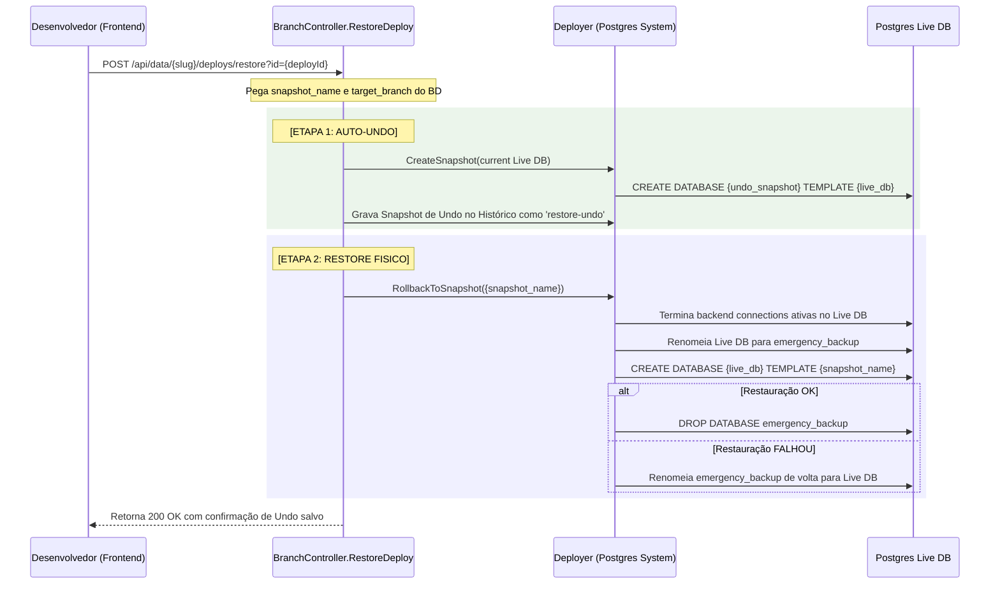

# Cascata Branching & Rollback: Arquitetura de Controle Estrutural e Físico

Este documento fornece a especificação de engenharia definitiva do **Sistema de Branching e Rollback do Cascata Orchestrator BaaS Multi-Tenant Go**, alinhada com as melhores práticas de isolamento físico de banco de dados, segurança lógica e conformidade com a **ISO 27.001**.

---

## 1. O Modelo Conceitual: Ambiente vs. Dados

No Cascata, uma branch não é meramente um ponteiro de código. Ela é uma entidade conceitual que divide **Estrutura (Ambiente)** e **Dados (Sandbox)** de forma isolada para garantir deploys 100% livres de corrupção ou perda de informações de produção.

| Conceito | Branch de Ambiente (Environment) | Branch de Dados (Data Sandbox) |
| :--- | :--- | :--- |
| **Peso / Custo** | Lightweight (Textual / Lógica) | Heavyweight (Física / Sob demanda) |
| **Conteúdo** | DDL (Schemas, Tabelas, RLS, RPCs, Triggers, Buckets, Auth configs) | Registro físico de tabelas Postgres clonadas com dados reais/seeds |
| **Ciclo de Vida** | Permanente (Versionada em arquivos/tabelas de metadados) | Efêmera (Destruída automaticamente via TTL configurável) |
| **Propósito** | Definição da estrutura do BaaS para Diff Engine e Deploy | Ambiente seguro e isolado para desenvolvedores testarem com dados reais |

> [!IMPORTANT]
> **A Regra de Ouro do Deploy**: O deploy de uma branch para a `Live/Main` **nunca manipula dados**. O que é promovido pelo Diff Engine são estritamente os metadados e esquemas estruturais lógicos (DDL), mantendo o banco de dados principal de produção do inquilino completamente blindado e intocado.

---

## 2. Visão Geral da Arquitetura de Banco de Dados

O ecossistema opera sob dois pools de conexões isolados para garantir que falhas lógicas nos bancos dos inquilinos nunca afetem as tabelas administrativas globais:

1. **System Database Pool (`SystemPool`)**:
   Gerencia os metadados do orquestrador global.
   * **Tabelas chaves**:
     * `system.branches`: Armazena metadados de branches de ambiente e referências a bancos de dados de branches de dados.
     * `system.branch_deploys`: Histórico completo de deploys, merges, snapshots e checkpoints físicos de undo.
   * **File Link**: [060_branching_system.sql](file:///home/cocorico/Documentos/proejetos/cascata%20go/backend/migrations/060_branching_system.sql#L72-L101)

2. **Project Database Pool (`ProjectPool`)**:
   Gerencia as conexões dinâmicas dos tenants/projetos. Cada projeto possui seu banco padrão (`cascata_{project_slug}`) e bancos temporários clonados para sandbox de dados (`cascata_{project_slug}_{branch_name}_data`).

```mermaid
graph TD
    subgraph System Database Pool (SystemPool)
        B[system.branches] -->|Cascating| D[system.branch_deploys]
    end

    subgraph Project Database Pool (ProjectPool)
        MainDB[(cascata_project)]
        SnapshotDB[(cascata_project_live_snapshot_xxxx)]
        DataBranchDB[(cascata_project_devbranch_data)]
    end

    MainDB -.->|CREATE DATABASE ... TEMPLATE| SnapshotDB
    SnapshotDB -.->|Restore State| MainDB
    SnapshotDB -->|Open Checkpoint as Branch| DataBranchDB
```

---

## 3. Fluxo de Engenharia & Provas de Código

### A. Clonagem e Abertura de Checkpoint como Branch

Quando o desenvolvedor deseja abrir um ponto específico no tempo do histórico de segurança, ele aciona o botão **Open Checkpoint**. O Cascata cria uma nova branch de dados física clonada diretamente a partir do snapshot físico indicado no Postgres, agindo como um sandbox isolado.

* **Assinatura no Manager**:
  O método [createDataBranchDB](file:///home/cocorico/Documentos/proejetos/cascata%20go/backend/internal/domain/branching/environment/manager.go#L565-L580) aceita o parâmetro opcional `sourceSnapshot`:
  ```go
  func (s *BranchService) createDataBranchDB(ctx context.Context, dbName, projectSlug string, sourceSnapshot *string) error {
      // Usa o banco do projeto como template por padrão
      templateDB := fmt.Sprintf("cascata_%s", projectSlug)
      if sourceSnapshot != nil && *sourceSnapshot != "" {
          templateDB = *sourceSnapshot
      }
      // ...
  ```

* **Prova em Código (Sanitização e Criação)**:
  ```go
  // [manager.go:L574-588]
  if !isValidDBName(dbName) {
      return fmt.Errorf("invalid database name: must contain only alphanumeric characters and underscores")
  }
  if sourceSnapshot != nil && *sourceSnapshot != "" {
      if !isValidDBName(*sourceSnapshot) {
          return fmt.Errorf("invalid source snapshot name: security restriction")
      }
  }

  sanitizedDBName := sanitizeIdentifier(dbName)
  sanitizedTemplateDB := sanitizeIdentifier(templateDB)

  query := fmt.Sprintf("CREATE DATABASE %s TEMPLATE %s", sanitizedDBName, sanitizedTemplateDB)
  _, err := s.pool.Exec(ctx, query)
  ```

* **Integração no Frontend**:
  O método `handleCreateBranchFromSnapshot` envia o `source_snapshot` no payload para materializar a branch de dados de forma transparente:
  ```typescript
  // [App.tsx:L247-268]
  const res = await fetch(`/api/data/${selectedProjectId}/branch/create`, {
    method: 'POST',
    headers: {
      'Authorization': `Bearer ${localStorage.getItem('cascata_token')}`,
      'Content-Type': 'application/json'
    },
    body: JSON.stringify({
      name: branchName.trim(),
      branch_type: 'data',
      parent_branch: 'main',
      source_snapshot: snapshotName
    })
  });
  ```

---

### B. Deploy Lógico com Snapshots de Segurança Físicos

Durante a promoção de um esquema lógico (deploy de branch) com a flag `SafetySnapshot` ativa, o motor de deploy assegura proteção física contra falhas de execução DDL:

1. **Criação de Snapshot**: 
   Acessa o banco do inquilino através de uma conexão efêmera isolada e gera um clone físico estrutural em background:
   ```go
   // [snapshot.go:L139-147]
   templateDBName := fmt.Sprintf("%s_snapshot_%s", dbName, uuid.New().String()[:8])
   createSQL := fmt.Sprintf("CREATE DATABASE %s TEMPLATE %s", templateDBName, dbName)
   _, err = sysConn.Exec(createSQL)
   ```
2. **Agendamento de Limpeza**:
   Mantém o snapshot físico por **720 horas (30 dias)** garantidos no Postgres para fins de demonstração, depuração e rollback sob demanda.
3. **Registro Histórico**:
   O `SnapshotName` gerado é capturado pelo controlador de deploy e salvo na tabela `system.branch_deploys` sob a coluna `snapshot_name`.
   * **File Links**: 
     * [deployer.go:L97-126](file:///home/cocorico/Documentos/proejetos/cascata%20go/backend/internal/domain/branching/deployer/deployer.go#L97-L126)
     * [branch.go:L547-555](file:///home/cocorico/Documentos/proejetos/cascata%20go/backend/internal/controllers/branch.go#L547-L555)

---

### C. Motor de Restore/Rollback com Auto-Undo Integrado

Ao solicitar a restauração do banco de dados principal para um checkpoint específico do histórico (`Restore State`), a engenharia do Cascata aplica uma estratégia de transação de banco de dados robusta para garantir que **nenhum estado de desenvolvimento ativo seja destruído**.



* **Prova em Código (Criando o Snapshot Auto-Undo no Restore)**:
  Antes de derrubar o banco de dados principal para fazer a restauração, salvamos o estado atual físico no Postgres e inserimos uma linha `restore-undo` no histórico do `SystemPool`:
  ```go
  // [branch.go:L698-725]
  undoSnapshotName := fmt.Sprintf("%s_%s_undo_restore_%d", ctx.Project.Slug, targetBranch, time.Now().Unix())
  undoSnapshot, err := c.Deployer.CreateSnapshot(r.Context(), ctx.Project.Slug, targetBranch, undoSnapshotName)
  if err != nil {
      fmt.Printf("[RestoreDeploy] Warning: failed to create undo checkpoint: %v\n", err)
  } else {
      var branchID string
      _ = services.SystemPool.QueryRow(r.Context(),
          `SELECT id FROM system.branches WHERE project_slug = $1 AND name = $2`,
          ctx.Project.Slug, targetBranch,
      ).Scan(&branchID)

      if branchID != "" {
          var triggeredBy *string
          if userID, ok := types.GetUserID(r.Context()); ok {
              triggeredBy = &userID
          }
          _, _ = services.SystemPool.Exec(r.Context(),
              `INSERT INTO system.branch_deploys
              (branch_id, source_branch, target_branch, status, diff_result, sql_statements, snapshot_name, completed_at, triggered_by)
              VALUES ($1, $2, $3, $4, $5::jsonb, $6, $7, NOW(), $8::uuid)`,
              branchID, "restore-undo", targetBranch, "success", 
              `{"message": "Auto-checkpoint created before restoring database state"}`, 
              []string{}, undoSnapshot.DBName, triggeredBy,
          )
      }
  }
  ```

---

## 4. Hardening de Segurança & Conformidade ISO 27.001

A arquitetura do Cascata de controle de versão adota os princípios mais rigorosos da **ISO 27.001 (Controle de Acesso, Integridade e Segregação de Funções)**:

### A. Higienização de Rotas de API
Anteriormente, o endpoint de deploys usava `/api/data/{slug}/branch/deploys`. Isso entrava em conflito com o middleware de segurança [ProjectResolver](file:///home/cocorico/Documentos/proejetos/cascata%20go/backend/internal/middleware/project.go) que tentava interpretar o sufixo `"deploys"` como um nome físico de branch, gerando falsos positivos e quebras de segurança.
* **Solução Implementada**: Movemos o histórico de deploys estrutural e o rollback para o nível da raiz do projeto:
  * Histórico de merges: `GET /api/data/{slug}/deploys`
  * Comando de rollback: `POST /api/data/{slug}/deploys/restore`
* **Benefício**: Zero interceptação de rotas e separação clara entre escopo de ramificação ativa e relatórios analíticos globais.

### B. Blindagem contra SQL Injection em DDL Físico
PostgreSQL não aceita placeholders parametrizados (`$1`) para nomes de bancos de dados ou tabelas em instruções DDL (como `CREATE DATABASE` ou `DROP DATABASE`).
* **Proteção Cascata**: 
  Todos os métodos de materialização aplicam um validador regex rígido (`isValidDBName`) que impede a passagem de caracteres como `;`, `--` ou espaços, além de utilizar delimitadores automáticos com `pgx.Identifier.QuoteString` para neutralizar ataques:
  ```go
  // [manager.go:L575-586]
  if !isValidDBName(dbName) {
      return fmt.Errorf("invalid database name: must contain only alphanumeric characters and underscores")
  }
  sanitizedDBName := sanitizeIdentifier(dbName)
  ```

---

## 5. Interface Premium do Dashboard (UX/UI)

O controle visual no frontend foi projetado de ponta a ponta em [App.tsx](file:///home/cocorico/Documentos/proejetos/cascata%20go/frontend/App.tsx) para oferecer uma experiência visual refinada e dinâmica:

```typescript
// [App.tsx:L917-942]
<div className="flex items-center gap-2">
  {/* Botão Deletar (Standby / Proteção) */}
  <button disabled className="opacity-40 cursor-not-allowed bg-slate-100 text-slate-400 px-3 py-2 rounded-xl font-black text-[9px] uppercase tracking-widest">
    <Trash2 size={11} /> Delete
  </button>

  {/* Botão Abrir Checkpoint como Branch de Dados Sandbox */}
  <button onClick={() => handleCreateBranchFromSnapshot(deploy.snapshot_name)} className="bg-indigo-50 hover:bg-indigo-100 text-indigo-600 border border-indigo-100 px-3 py-2 rounded-xl font-black text-[9px] uppercase tracking-widest transition-all">
    <FolderOpen size={11} /> Open Checkpoint
  </button>

  {/* Botão Restaurar Checkpoint Físico (com Auto-Undo Integrado) */}
  <button disabled={restoringId !== null || deploy.status === 'rolled_back'} onClick={() => handleRestoreDeploy(deploy.id)} className={`px-3 py-2 rounded-xl font-black text-[9px] uppercase tracking-widest transition-all ${
    deploy.status === 'rolled_back'
      ? 'bg-slate-100 text-slate-500 cursor-default'
      : 'bg-emerald-50 hover:bg-emerald-100 text-emerald-600 border border-emerald-100 shadow-sm hover:shadow'
  }`}>
    {restoringId === deploy.id ? <Loader2 size={11} className="animate-spin" /> : <RefreshCw size={11} />}
    {deploy.status === 'rolled_back' ? 'Restored' : 'Restore State'}
  </button>
</div>
```

---

## 6. Resumo dos Arquivos do Sistema de Branching

Seja para auditorias de segurança ou para evolução da plataforma, estes são os componentes principais que gerenciam a infraestrutura:

* **Gerenciador de Ciclo de Vida**: [manager.go](file:///home/cocorico/Documentos/proejetos/cascata%20go/backend/internal/domain/branching/environment/manager.go) (Orquestra a criação, exclusão, TTL e clonagem Postgres).
* **Controlador de Rotas de API**: [branch.go](file:///home/cocorico/Documentos/proejetos/cascata%20go/backend/internal/controllers/branch.go) (Controla endpoints de criação, deploy, histórico e o motor de restore).
* **Motor Físico de Snapshots**: [snapshot.go](file:///home/cocorico/Documentos/proejetos/cascata%20go/backend/internal/domain/branching/deployer/snapshot.go) (Gerencia as chamadas DDL de `TEMPLATE` e o rollback de emergência no Postgres).
* **Roteador Principal**: [main.go](file:///home/cocorico/Documentos/proejetos/cascata%20go/backend/cmd/server/main.go) (Expõe os caminhos higienizados na API rest global).
* **Interface UI/UX**: [App.tsx](file:///home/cocorico/Documentos/proejetos/cascata%20go/frontend/App.tsx) (Garante loaders individuais, animações elásticas e a aba dinâmica de histórico).
