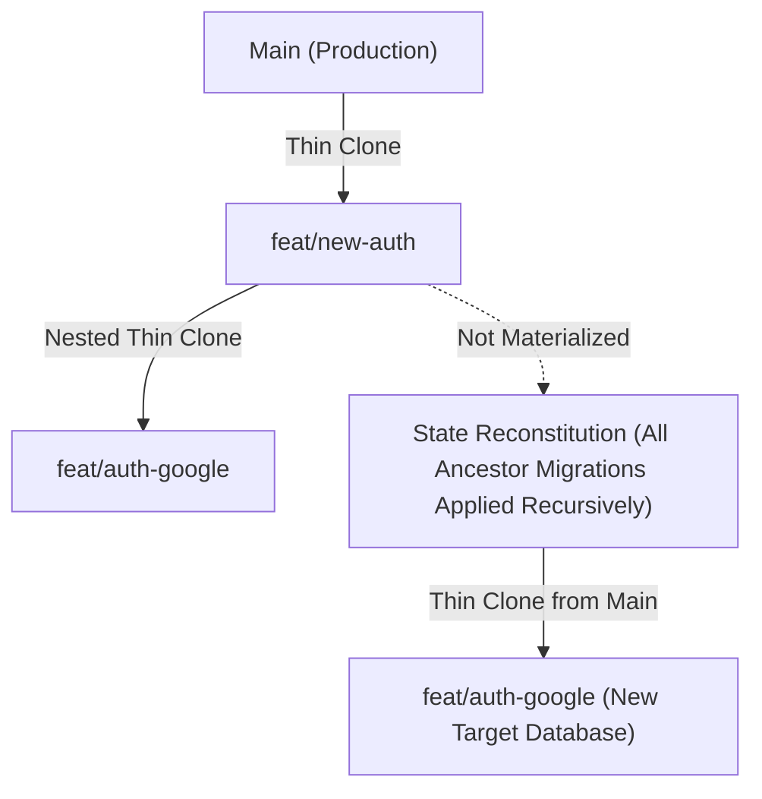

# Relatório de Ramificação Hierárquica e Rollback de Segurança

Este relatório consolida o grande upgrade de infraestrutura e interface do sistema de branches do **Cascata Go**, garantindo aninhamento recursivo de branches (árvore estrutural), recomposição perfeita de schemas e controle visual soberbo de merges e rollbacks.

---

## 1. Arquitetura e Sinergia das Novas Mecânicas

### A. Ramificação Aninhada (Parent Branch Resolution)
O backend agora resolve o banco de dados de origem de forma inteligente ao materializar uma branch de ambiente no Postgres:
1. **Branch Pai Materializada**: Se a branch foi criada a partir de uma branch pai (diferente de `main`/`live`) e o banco de dados físico da branch pai estiver materializado ativamente no postgres, a nova branch realiza o thin-clone (`CREATE DATABASE ... TEMPLATE`) **diretamente a partir do banco da branch pai**. Isso preserva instantaneamente todas as alterações estruturais acumuladas no ramo pai.
2. **Ancestrais Não Materializados (Recomposição Recursiva)**: Se a branch pai ou seus ancestrais não estão materializados fisicamente (expirados pelo TTL ou não acessados), o thin-clone é criado a partir do `main`, mas o motor de hidratação caminha recursivamente para cima na linhagem da árvore acumulando as migrations de todos os ancestrais não materializados de forma ordenada (do ancestral mais antigo para a branch atual) e as aplica de forma atômica. Isso garante **perfeita consistência e zero perda de schema**.

### B. Linha do Tempo e Snapshots de Segurança
Durante a rota de Deploy/Merge (`DeployWithSafety`), o backend executa:
- Criação física de um snapshot usando `CREATE DATABASE ... TEMPLATE` após terminação segura das conexões ativas (`pg_terminate_backend`).
- Se o deploy falhar, o rollback é instantâneo e automático.
- Se o deploy for bem-sucedido, o snapshot é mantido por 24 horas para rollback manual e registrado na tabela `system.branch_deploys`.
- O frontend agora consome e apresenta essa timeline de snapshots para auditoria do desenvolvedor.

---

## 2. Arquivos Modificados e Criados

### 1. Backend: [manager.go](file:///home/cocorico/Documentos/proejetos/cascata%20go/backend/internal/domain/branching/environment/manager.go)
- **accessEnvironmentBranch**: Modificado para selecionar dinamicamente o `sourceDB` a partir do banco materializado da branch pai (`parent_branch`) se disponível.
- **materializeThinClone**: Implementada a recomposição recursiva de migrations ancestrais acumulando e aplicando cronologicamente o delta de todas as branches pais não ativas no Postgres.

### 2. Backend: [branch.go](file:///home/cocorico/Documentos/proejetos/cascata%20go/backend/internal/controllers/branch.go)
- **ListDeploys**: Criado o endpoint do controlador para consultar os registros de merges na tabela `system.branch_deploys` via `SystemPool` e retornar a timeline em formato JSON.

### 3. Backend: [main.go](file:///home/cocorico/Documentos/proejetos/cascata%20go/backend/cmd/server/main.go)
- Registrada a rota `GET /deploys` sob o grupo `/api/data/{slug}/branch`.

### 4. Frontend: [App.tsx](file:///home/cocorico/Documentos/proejetos/cascata%20go/frontend/App.tsx)
- **State Management**: Adicionados hooks `branchTab`, `branchParentName`, `deploysHistory` e `deploysLoading`.
- **API Hydration**: Criada a função `loadDeploysHistory` para carregar logs de deploys e atualizado `handleCreateBranch` para enviar o `parent_branch` dinamicamente.
- **Live Input Sanitization (Autocorreção)**: Implementado corretor em tempo real no campo de nome da branch. Ao digitar, acentos (`~`, `ç`, `^`, `´`) são automaticamente normalizados, espaços viram traços (`-`), caracteres especiais não aceitos são excluídos e tudo é convertido para minúsculas, forçando um padrão perfeito e à prova de falhas antes da requisição.
- **UI Redesign**:
  - Modal **Branch Manager** agora possui uma Tab Bar premium com as abas "Environment Branches" e "Merge & Checkpoint History".
  - Formulário com dropdown elegante listando branches existentes como opções de pai (para ramificação aninhada).
  - Linha do tempo vertical moderna na aba de histórico exibindo status, caminhos dos merges, durações, nomes dos checkpoints e botões explicativos de Rollback direcionados para ambientes de teste e VPS.

---

## 3. Conclusão e Próximos Passos
As implementações operam em sinergia absoluta: o frontend agora reflete fielmente as capacidades robustas do motor de branches e checkpoints do backend, provendo uma experiência premium e profissional digna de uma plataforma em nível Enterprise.
O ambiente está consolidado e totalmente estável!
