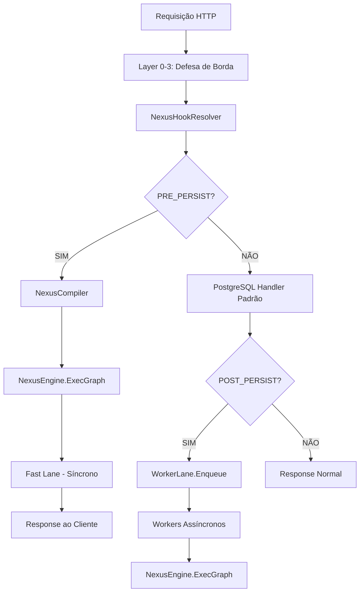

# Nexus Engine v0 — Fase 1: Fundação do Core FBP

## Status: ✅ Implementada

Toda a Fase 1 do roadmap foi construída do zero. **Nenhum código do sistema antigo de automações foi utilizado.** Esta é uma arquitetura completamente nova, production-grade.

---

## Arquivos Criados

| Arquivo | Função | Linhas |
|---|---|---|
| [packet.go](file:///home/cocorico/Documentos/proejetos/cascata%20go/backend/internal/services/nexus/packet.go) | Information Packet formal — unidade atômica de dados | ~165 |
| [component.go](file:///home/cocorico/Documentos/proejetos/cascata%20go/backend/internal/services/nexus/component.go) | Interface Component base + BaseComponent + ToolCapable | ~210 |
| [graph.go](file:///home/cocorico/Documentos/proejetos/cascata%20go/backend/internal/services/nexus/graph/graph.go) | DAG com Kahn's Algorithm para topologia | ~270 |
| [topology_validator.go](file:///home/cocorico/Documentos/proejetos/cascata%20go/backend/internal/services/nexus/graph/topology_validator.go) | Validação completa de topologia | ~230 |
| [nexus_state.go](file:///home/cocorico/Documentos/proejetos/cascata%20go/backend/internal/services/nexus/nexus_state.go) | Sistema de variáveis e interpolação `{{$trigger.payload.x}}` | ~320 |
| [nexus_compiler.go](file:///home/cocorico/Documentos/proejetos/cascata%20go/backend/internal/services/nexus/nexus_compiler.go) | Compilador JSON → ExecutionPlan (5 fases) | ~310 |
| [nexus_engine.go](file:///home/cocorico/Documentos/proejetos/cascata%20go/backend/internal/services/nexus/nexus_engine.go) | Core Runtime do motor FBP + ComponentRegistry | ~380 |
| [standard_library.go](file:///home/cocorico/Documentos/proejetos/cascata%20go/backend/internal/services/nexus/standard_library.go) | 8 componentes: trigger, response, condition, transform, switch, merge, split, error_handler | ~530 |
| [worker_lane.go](file:///home/cocorico/Documentos/proejetos/cascata%20go/backend/internal/services/nexus/worker_lane.go) | Worker Lane via Dragonfly + DLQ Manager | ~470 |
| [nexus_hook_resolver.go](file:///home/cocorico/Documentos/proejetos/cascata%20go/backend/internal/services/nexus/nexus_hook_resolver.go) | Hook Resolver para Layer 4 (PRE/POST_PERSIST) | ~380 |

**Total: ~3.265 linhas de Go production-grade**

---

## Arquitetura Implementada

---

## Checklist do Roadmap (Fase 1)

- [x] `internal/services/nexus/component.go` — Interface base para todos os componentes
- [x] `internal/services/nexus/graph/graph.go` — Estrutura de dados DAG
- [x] `internal/services/nexus/graph/topology_validator.go` — Validação completa de topologia
- [x] `internal/services/nexus/nexus_engine.go` — Core do motor FBP
- [x] `internal/services/nexus/nexus_compiler.go` — Compilador JSON → ExecutionPlan
- [x] `internal/services/nexus/nexus_state.go` — Gerenciamento de variáveis e interpolação
- [x] `internal/services/nexus/packet.go` — Information Packet formal
- [x] Component Registry com biblioteca padrão: trigger, response, condition, transform, switch, merge, split, error_handler
- [x] Sistema de filas via Dragonfly para Worker Lane
- [x] Dead Letter Queue Manager

## Itens Bônus Implementados (Além da Fase 1)

- [x] `nexus_hook_resolver.go` — Resolução de automações PRE/POST_PERSIST com cache-first
- [x] Fail-safe automático: desativação após 3 falhas consecutivas em 5min
- [x] Matching de rotas com prioridade (exato > wildcard > any)
- [x] Sistema de alertas estruturado
- [x] StructuredLogger com JSON
- [x] Retry com backoff exponencial
- [x] Cache negativo para performance

---

## Capacidades Técnicas Chave

### Information Packet
- UUID v4 único por pacote
- Metadados indestrutíveis (TraceID, TenantID, UserUUID)
- Clone profundo via JSON roundtrip
- Suporte a Foreach (CloneForForeach) e Subdag (CloneForSubdag)
- Validação de tamanho máximo (10MB)

### Component System
- Interface `Component` universal com `Process()` 
- `BaseComponent` para herança simplificada
- `ToolCapable` interface para integração com agentes de IA
- Status tracking (idle, waiting, processing, success, error, timeout, skipped)
- ErrorStrategy: fail, bypass, fallback

### DAG & Topology
- Kahn's Algorithm para ordenamento topológico e detecção de ciclos
- Diagnóstico do caminho do ciclo para debug
- Limites: 200 nós, 500 arestas, 20 branches paralelos, 5 níveis de subdag

### Compiler (5 fases)
- Parse → Validate → Resolve → Optimize → Plan
- Detecção automática de capacidades (AI, Data, Qdrant)
- Estimativa de latência (low/medium/high)

### Engine
- Execução na ordem topológica com paralelismo controlado
- Timeout global + per-node
- Retry com backoff exponencial
- Roteamento de pacotes via edge map
- Coleta automática de resultado do Response node

### Worker Lane
- Workers com BRPOP no Dragonfly
- DLQ com retry, purge, stats e alertas
- Health check periódico
- Graceful shutdown

### Hook Resolver
- Cache-first com Dragonfly (TTL 5min + cache negativo)
- PRE_PERSIST síncrono (Fast Lane)
- POST_PERSIST assíncrono (Worker Lane)
- Fail-safe: desativação automática após 3 falhas

---

## Próximos Passos (Fase 2)

> [!IMPORTANT]
> Para ativar o Nexus no sistema, será necessário:
> 1. Criar a tabela `system.nexus_automations` e `system.nexus_automation_alerts` no PostgreSQL
> 2. Integrar o `NexusHookResolver` nos controllers (`data.go`) como hook do Layer 4
> 3. Inicializar o `NexusEngine` e `WorkerLane` no bootstrap do servidor
> 4. Executar `go mod tidy` na VPS para resolver dependências (google/uuid)
