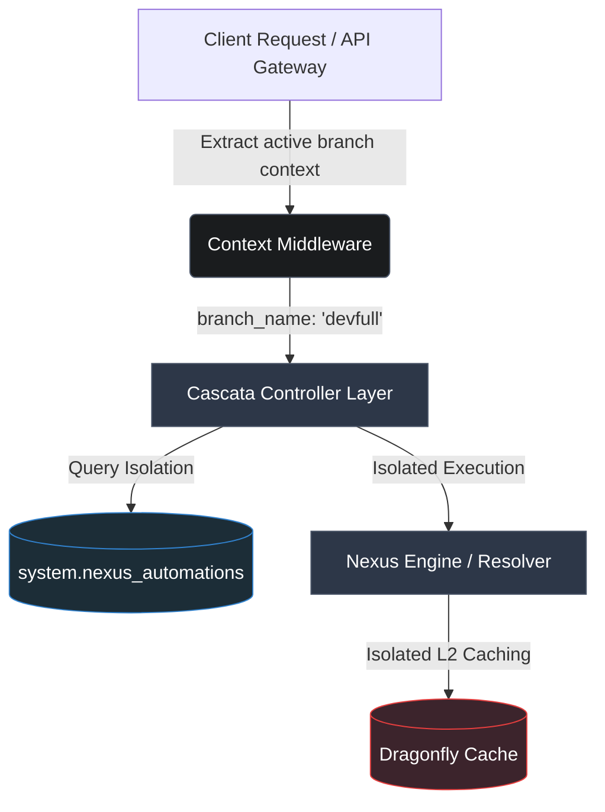

# Branch Isolation for Nexus Orchestrator & Storage Engine

This implementation plan documents the architecture and changes introduced to bring complete, production-grade **branch isolation** to both the **Nexus Orchestrator** automations engine and the **Storage Engine** in **Cascata Orchestrator** (v0.1.0-Glory). 

By isolating automations and assets on a per-branch basis, sandboxed branches (such as `devfull`) can create, update, trigger, and destroy workflows without any cross-branch contamination or leakage into `main`.

---

## 1. Architectural Highlights



### Key Mechanisms:
1. **Schema Hardening**: Adding a default `branch_name` column to the canon table (`system.nexus_automations`) pointing to `'main'` by default.
2. **Context-Aware Routing**: Pulling the active branch seamlessly from the HTTP/RPC request context via `types.GetBranchName(ctx)`.
3. **Database Level Isolation**: Hardening SQL predicates for `SELECT`, `INSERT`, `UPDATE`, and `DELETE` on system tables to restrict matches to both `tenant_id` (the project slug) and `branch_name`.
4. **Isolated Layer-1 & Layer-2 Cache keys**: Separating cached automation records in the memory map (L1) and Dragonfly (L2) with branch tags to prevent cache poisoning across environments.

---

## 2. Detailed File Modifications

### A. Database Auto-Migration Bootloader
Added an idempotent schema hardening hook inside `/backend/internal/services/pool.go` that ensures `branch_name` exists on the automation canvas:

```go
// EnsureNexusAutomationsBranchColumn ensures system.nexus_automations has the branch_name column
func EnsureNexusAutomationsBranchColumn(ctx context.Context) error {
	if SystemPool == nil {
		return fmt.Errorf("SystemPool not initialized")
	}
	_, err := SystemPool.Exec(ctx, `
		ALTER TABLE system.nexus_automations ADD COLUMN IF NOT EXISTS branch_name TEXT NOT NULL DEFAULT 'main';
	`)
	return err
}
```

### B. Controller Layer (`data.go` & `webhook.go`)
- **`ListAutomations`**: Isolates results so that they only show workflows belonging to the requested sandbox branch:
  ```sql
  SELECT id, name, description, ... FROM system.nexus_automations 
  WHERE tenant_id = $1 AND branch_name = $2
  ```
- **`UpsertAutomation`**: 
  - Retrieves `status` by querying the current branch version of the automation.
  - Updates only the record corresponding to the current branch.
  - Inserts are populated with `branch_name` on execution.
- **`DeleteAutomation`**: Limits deletion exclusively to the currently active branch of the tenant.
- **`ActivateAutomation` / `DeactivateAutomation` / `TestAutomation`**: Conflicts validation and execution parameters are resolved on the specific branch.
- **`HandleIncoming` (Public Webhooks)**: Public webhook interceptor checks receivers by mapping the `path_slug` within the corresponding branch context.

### C. Nexus Engine Resolver (`nexus_hook_resolver.go`)
- Loaded `"cascata-backend/internal/types"` package to interact with branching mechanisms.
- **`findMatchingAutomation` & `invalidateAutomationCache`**: Key names inside L2 Dragonfly caching are constructed with branch identifiers if not executing on `main` (e.g. `nexus:automations:jige:devfull:WEBHOOK:POST:/webhook/slug`):
  ```go
  branchName := types.GetBranchName(ctx)
  tenantBranchKey := tenantID
  if branchName != "main" {
      tenantBranchKey = tenantID + ":" + branchName
  }
  ```
- **`findAutomationByID` & `queryAutomationFromDB`**: Queries database rows restricting retrieval by the active branch name.

### D. Intelligent Webhook Routing & Parity
- **Branch URL Rewriting**: The `BranchRewriterInterceptor` has been completely unified to support branch-aware webhook endpoints out-of-the-box:
  - `https://{projectSlug}.unibloom.com.br/webhook/branch/{branchName}/{pathSlug}` is automatically intercepted, setting the `X-Cascata-Env` header to `{branchName}` and rewriting the target routing path to `/webhook/{pathSlug}` before matching the Go-Chi routing tree.
  - This allows sandbox environments to receive live webhooks without slug collision or manually renaming webhook paths.
- **Frontend Synergy & Subdomain Integrity**: The `NexusArchitect` component automatically detects the active branch workspace environment and builds the correct, official subdomain URL:
  - `https://{projectId}.unibloom.com.br/webhook/branch/{branchName}/{webhookPath}` (or custom domain if configured), maintaining absolute architecture parity.
- **Absolute URL-First Isolation**: We completely eliminated cookie-based branch resolution (`cascata_active_env`) in the backend project resolver to prevent cross-tab state contamination. Instead, a global `window.fetch` interceptor in `App.tsx` dynamically extracts the branch from the browser URL's hash routing context and injects the `X-Cascata-Env` header. This ensures perfect tab-based isolation: two browser tabs can operate on different branches simultaneously with zero leakage or "locking" bugs.

---

## 3. Benefits & Real-World Readiness
- **Zero Contamination**: Modifying an interceptor hook or webhook trigger in `devfull` has absolutely no effect on production handlers.
- **Multi-Tab Harmony**: Developers can safely work on `main` and sandboxes in separate browser tabs concurrently.
- **Ultra-Performance**: Caching layers are isolated natively, maintaining sub-millisecond retrieval through Dragonfly while completely eliminating stale cache issues.
- **State-of-the-Art Hardening**: Schema checks auto-migrate database engines across host servers seamlessly without manual intervention.
- **Flawless DevOps Transition**: Developers can test webhooks in sandbox environments directly, then deploy safely to production with 100% path parity and absolute zero configuration changes.
