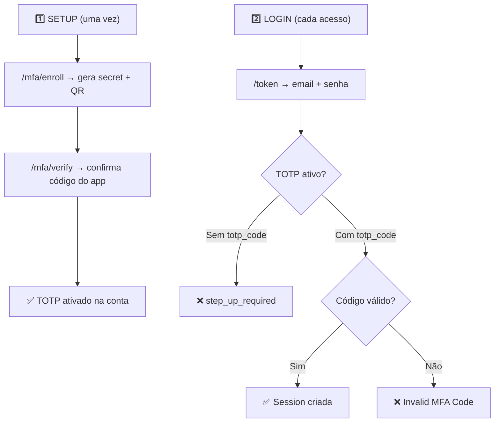

# 🔐 Análise: Fluxo Correto de Login com TOTP no Cascata Auth

## Diagnóstico Rápido

> [!IMPORTANT]
> **O problema é o nome do campo JSON.** O sistema espera `"totp_code"`, mas você enviou `"code"` e `"provider"`. Esses campos são ignorados pelo parser do `/token`.

---

## Anatomia do Fluxo Completo

O sistema TOTP do Cascata tem **dois momentos completamente distintos**:



---

## Fase 1: Setup do TOTP (Já Feito ✅)

Esses endpoints usam `Bearer Token` do usuário já logado:

### 1.1 Enroll
```bash
POST /auth/v1/mfa/enroll
Authorization: Bearer <access_token>
# → Retorna: { "secret": "BASE32...", "qr_code_url": "otpauth://..." }
```

### 1.2 Verify (ativa o TOTP)
```bash
POST /auth/v1/mfa/verify
Authorization: Bearer <access_token>
Content-Type: application/json
{ "code": "651232" }
# → Retorna: { "success": true, "message": "MFA activated successfully" }
```

> [!NOTE]
> No `/mfa/verify`, o campo **é `"code"`** mesmo — está correto. Esse endpoint é diferente do `/token`.

---

## Fase 2: Login com TOTP (Onde está o erro)

### ❌ O que você enviou (ERRADO):
```json
{
  "password": "secure_password_123",
  "grant_type": "password",
  "email": "user@examplee.com",
  "provider": "totp",      // ← IGNORADO pelo parser de login
  "code": "024143"          // ← CAMPO ERRADO! O sistema não lê "code" aqui
}
```

### ✅ O formato CORRETO:
```json
{
  "email": "user@examplee.com",
  "password": "secure_password_123",
  "grant_type": "password",
  "totp_code": "024143"
}
```

### Curl correto:
```bash
curl -X POST "https://dash.unibloom.com.br/api/data/instanciainfra/auth/v1/token" \
  -H "apikey: SUA_API_KEY" \
  -H "Content-Type: application/json" \
  -d '{
  "email": "user@examplee.com",
  "password": "secure_password_123",
  "grant_type": "password",
  "totp_code": "CODIGO_DO_APP_AUTHENTICATOR"
}'
```

---

## Por que aconteceu?

A struct que o endpoint `/token` espera está definida em [gotrue.go](file:///home/cocorico/Documentos/proejetos/cascata%20go/backend/internal/services/gotrue.go#L16-L27):

```go
type GoTrueTokenParams struct {
    Email        string `json:"email"`
    Identifier   string `json:"identifier"`
    Password     string `json:"password"`
    RefreshToken string `json:"refresh_token"`
    IdToken      string `json:"id_token"`
    Provider     string `json:"provider"`       // ← Usado para identity lookup, NÃO para MFA
    GrantType    string `json:"grant_type"`
    Token        string `json:"token"`
    Language     string `json:"language"`
    TotpCode     string `json:"totp_code"`      // ← ESTE é o campo do TOTP!
}
```

E a lógica de verificação em [gotrue.go:172-183](file:///home/cocorico/Documentos/proejetos/cascata%20go/backend/internal/services/gotrue.go#L172-L183):

```go
// MFA Check (Only verified TOTP secrets are checked)
var totpSecret string
err = pool.QueryRow(ctx, 
    "SELECT identifier FROM auth.identities WHERE user_id = $1 AND provider = 'totp' AND verified_at IS NOT NULL LIMIT 1", 
    identity.UserId).Scan(&totpSecret)

if err == nil && totpSecret != "" {
    if params.TotpCode == "" {           // ← Verifica params.TotpCode
        // step_up_required!
    }
    if !authSvc.VerifyTOTP(totpSecret, params.TotpCode) {
        // Invalid MFA Code
    }
}
```

---

## Resumo das Diferenças de Campo

| Endpoint | Campo do Código | Contexto |
|----------|----------------|----------|
| `/mfa/verify` | `"code"` | Setup inicial (com Bearer Token) |
| `/mfa/enroll` | — | Não recebe código |
| `/token` | `"totp_code"` | Login com MFA |
| `/challenge` | — | Inicia passwordless |
| `/verify-challenge` | `"code"` | Verifica passwordless |

> [!TIP]
> O campo `"provider"` no `/token` serve para indicar qual **identity** buscar (email, phone, etc.), **NÃO** é o fator MFA. Quando você enviou `"provider": "totp"`, o sistema procurou uma identidade com `provider='totp'` para fazer login, e não encontrou credenciais de senha nessa identidade.

---

## Fluxo Unificado (Single Request)

O design do Cascata permite login com TOTP em **uma única chamada**. Não é um fluxo de 2 etapas como Supabase:

```
Supabase: POST /token (senha) → recebe challenge_id → POST /mfa/verify (código)
Cascata:  POST /token (senha + totp_code) → recebe session diretamente ✅
```

Isso é uma vantagem arquitetural — menos round-trips, menos latência, melhor UX.

### Fluxo no Frontend:
1. Usuário digita email + senha → clica "Entrar"
2. Se receber `step_up_required` → mostra campo de TOTP
3. Re-envia **o mesmo request** adicionando `totp_code` → recebe session

---

## Próximos Passos

Depois de validar o login TOTP com o curl correto, podemos:
1. **Atualizar o frontend** para exibir o campo TOTP quando receber `step_up_required`
2. **Atualizar a documentação da API** para listar `totp_code` como campo opcional no `/token`
3. **Garantir separação Owner vs Consumer** — confirmar que o TOTP de nível sistema (owner/worker) nunca interfere no TOTP de tenant consumer
